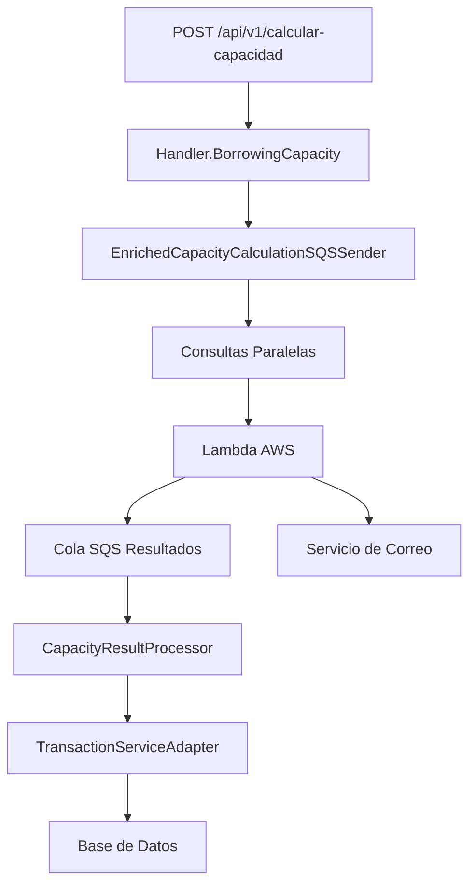

# 📚 MANUAL TÉCNICO - HU7: CAPACIDAD DE ENDEUDAMIENTO

## 📋 **INFORMACIÓN GENERAL**

| **Campo** | **Valor** |
|-----------|-----------|
| **Historia de Usuario** | HU7 - Cálculo de Capacidad de Endeudamiento |
| **Versión** | 1.0 |
| **Fecha** | Diciembre 2024 |
| **Arquitectura** | Hexagonal + Programación Reactiva |
| **Tecnologías** | Spring WebFlux, R2DBC, AWS SQS, Lambda |

---

## 🎯 **DESCRIPCIÓN FUNCIONAL**

### **Objetivo**
Implementar un sistema automatizado de evaluación de capacidad de endeudamiento que determine si un solicitante puede acceder a un nuevo préstamo basado en sus ingresos, deudas actuales y políticas de riesgo establecidas.

### **Alcance**
- Evaluación automática de solicitudes de crédito
- Cálculo de capacidad de endeudamiento según políticas de riesgo
- Procesamiento asíncrono mediante Lambda AWS
- Actualización atómica del estado de solicitudes
- Notificación por correo con plan de pagos

---

## 🏗️ **ARQUITECTURA DEL SISTEMA**

### **Diagrama de Flujo**


### **Componentes Principales**

#### **1. Capa de Presentación**
- **Endpoint**: `POST /api/v1/calcular-capacidad`
- **Handler**: `Handler.BorrowingCapacity()`
- **DTO**: `CreditApplicationDTO`

#### **2. Capa de Dominio**
- **Modelo**: `CreditApplication`
- **Casos de Uso**: `CapacityCalculationUseCase`
- **Interfaces**: `EnrichedCapacityCalculationService`

#### **3. Capa de Infraestructura**
- **SQS Sender**: `EnrichedCapacityCalculationSQSSender`
- **SQS Listener**: `CapacityResultProcessor`
- **Repositorios**: R2DBC adapters
- **Servicios Externos**: `AuthClient`, Lambda AWS

---

## 🔄 **FLUJO TÉCNICO DETALLADO**

### **FASE 1: Recepción de Solicitud**

#### **1.1 Endpoint de Entrada**
```java
// Handler.java - Línea 178
@Operation(summary = "Calcula la capacidad de endeudamiento")
public Mono<ServerResponse> BorrowingCapacity(ServerRequest serverRequest)
```

**Responsabilidades:**
- Validación de entrada con Bean Validation
- Mapeo de DTO a modelo de dominio
- Invocación del servicio de enriquecimiento

#### **1.2 Validaciones de Entrada**
```java
// CreditApplicationDTO validations
@NotNull(message = "El monto solicitado es obligatorio")
@Min(value = 1, message = "El plazo mínimo es 1 mes")
@Max(value = 360, message = "El plazo máximo es 360 meses")
@Pattern(regexp = "^[a-zA-Z0-9_+&*-]+(?:\\.[a-zA-Z0-9_+&*-]+)*@(?:[a-zA-Z0-9-]+\\.)+[a-zA-Z]{2,7}$")
```

### **FASE 2: Enriquecimiento de Datos**

#### **2.1 Consultas Paralelas**
```java
// EnrichedCapacityCalculationSQSSender.java - Línea 50-54
return Mono.zip(
    loanTypeRepository.findLoanTypeById(creditApplication.getIdLoanType()),
    authClient.findUserByEmail(creditApplication.getEmail()),
    activeLoanRepository.findActiveLoansByEmail(creditApplication.getEmail()).collectList()
)
```

**Datos Obtenidos:**
- **Tipo de Préstamo**: Tasa de interés, límites, configuración
- **Usuario**: Salario base, información personal
- **Préstamos Activos**: Lista de créditos con estado "Aprobado"

#### **2.2 Cálculo de Capacidad Base**
```java
// CapacityCalculationGateway.calculateBorrowingCapacity()
BigDecimal maxBorrowingCapacity = baseSalary.multiply(BigDecimal.valueOf(0.35));
```

#### **2.3 Estructura del Mensaje Enriquecido**
```json
{
  "idRequest": 88,
  "documentType": "CC",
  "documentNumber": "123456789",
  "creditAmount": 1000000,
  "creditTime": 24,
  "email": "librecarbon@gmail.com",
  "idState": 1,
  "idLoanType": 3,
  "interestRate": 18.0,
  "baseSalary": 12000000.00,
  "maxBorrowingCapacity": 4200000.00,
  "activeLoans": [
    {
      "idRequest": 85,
      "creditAmount": 5000000,
      "creditTime": 36,
      "interestRate": 15.8,
      "monthlyRequestAmount": 180500.00
    }
  ]
}
```

### **FASE 3: Procesamiento en Lambda AWS**

#### **3.1 Lógica de Evaluación**

**Paso 1: Cálculo de Deuda Mensual Actual**
```javascript
// Lambda AWS - Cálculo de cuotas existentes
let currentMonthlyDebt = 0;
activeLoans.forEach(loan => {
    const monthlyPayment = calculateMonthlyPayment(
        loan.creditAmount, 
        loan.interestRate / 100 / 12, 
        loan.creditTime
    );
    currentMonthlyDebt += monthlyPayment;
});
```

**Paso 2: Capacidad Disponible**
```javascript
const availableCapacity = maxBorrowingCapacity - currentMonthlyDebt;
```

**Paso 3: Cuota del Nuevo Préstamo**
```javascript
// Fórmula de amortización francesa
const monthlyRate = interestRate / 100 / 12;
const monthlyPayment = principal * 
    (monthlyRate * Math.pow(1 + monthlyRate, months)) /
    (Math.pow(1 + monthlyRate, months) - 1);
```

**Paso 4: Lógica de Decisión**
```javascript
let decision, state, idState;

if (monthlyPayment <= availableCapacity) {
    // Verificar si requiere revisión manual (>5 salarios)
    if (creditAmount > (baseSalary * 5)) {
        decision = "REVISION_MANUAL";
        state = "Revision Manual";
        idState = 4;
    } else {
        decision = "APROBADO";
        state = "Aprobado";
        idState = 2;
    }
} else {
    decision = "RECHAZADO";
    state = "Rechazado";
    idState = 3;
}
```

#### **3.2 Respuesta de Lambda**
```json
{
  "idRequest": 88,
  "email": "librecarbon@gmail.com",
  "state": "Aprobado"
}
```

### **FASE 4: Procesamiento de Resultado**

#### **4.1 Listener SQS**
```java
// SQSListener.java - Polling continuo
private Flux<Void> listen() {
    return getMessages()
        .flatMap(message -> processor.apply(message)
            .then(confirm(message)));
}
```

#### **4.2 Procesamiento del Mensaje**
```java
// CapacityResultProcessor.processMessage()
CapacityResultDTO capacityResult = objectMapper.readValue(message.body(), CapacityResultDTO.class);
Short idState = mapStateStringToId(capacityResult.getState());
```

#### **4.3 Actualización Atómica**
```java
// TransactionServiceAdapter.updateStateWithCapacityResult()
@Transactional
public Mono<CreditApplication> updateStateWithCapacityResult(
    CreditApplication creditApplication, String capacityResult) {
    
    String sql = """
        UPDATE users_info 
        SET id_state = :stateId
        WHERE id_request = :idRequest
        """;
}
```

---

## 📊 **CRITERIOS DE ACEPTACIÓN TÉCNICOS**

### **CA-1: Validación Automática**
```java
// AutomaticValidationAdapter.processAutomaticValidation()
if (loanType.autoValidation() != null && loanType.autoValidation()) {
    return triggerCapacityCalculation(creditApplication);
}
```

### **CA-2: Política de Riesgo (35%)**
```java
// Implementado en Lambda AWS
const MAX_DEBT_RATIO = 0.35;
const maxBorrowingCapacity = baseSalary * MAX_DEBT_RATIO;
```

### **CA-3: Cálculo de Deuda Actual**
```sql
-- ActiveLoanRepositoryAdapter
SELECT * FROM users_info WHERE email = :email AND id_state = 2
```

### **CA-4: Fórmula de Amortización**
```javascript
// Lambda AWS - Fórmula francesa
Cuota = P * (i * (1 + i)^n) / ((1 + i)^n - 1)
```

### **CA-5: Lógica de Decisión**
| **Condición** | **Estado** | **ID** |
|---------------|------------|--------|
| `CuotaNueva ≤ CapacidadDisponible && Monto ≤ 5*Salario` | Aprobado | 2 |
| `CuotaNueva ≤ CapacidadDisponible && Monto > 5*Salario` | Revisión Manual | 4 |
| `CuotaNueva > CapacidadDisponible` | Rechazado | 3 |

---

## 🔧 **CONFIGURACIÓN TÉCNICA**

### **Configuración SQS**
```yaml
# application-capacity.yaml
adapter:
  sqs:
    capacity-queue-url: "https://us-east-2.queue.amazonaws.com/155290702720/CapacidadEndeudamiento"
    
entrypoint:
  sqs:
    queueUrl: "https://sqs.us-east-2.amazonaws.com/155290702720/CapacidadResultados"
    waitTimeSeconds: 20
    maxNumberOfMessages: 10
    numberOfThreads: 2
```

### **Configuración Base de Datos**
```sql
-- Schema users_info
CREATE TABLE IF NOT EXISTS users_info (
    id_request INTEGER PRIMARY KEY,
    document_type VARCHAR(10) NOT NULL,
    document_number VARCHAR(20) NOT NULL,
    credit_amount DECIMAL(15,2) NOT NULL,
    credit_time INTEGER NOT NULL,
    email VARCHAR(100) NOT NULL,
    id_state SMALLINT NOT NULL,
    id_loan_type SMALLINT NOT NULL
);
```

---

## 📝 **LOGGING Y MONITOREO**

### **Trazas de Logging**
```java
// Logging estructurado implementado
🔵 [SQS-RAW] JSON recibido de cola externa
🟢 [DESERIALIZADO] DTO creado - ID: 88, Estado: Aprobado
🟡 [UPDATE-ENTRADA] Iniciando actualización BD
🔍 [BD-FOUND] Solicitud encontrada
🔄 [BD-UPDATE] Cambiando estado de 1 a 2
✅ [BD-SUCCESS] Solicitud actualizada exitosamente
🎉 [PROCESO-COMPLETO] Mensaje procesado exitosamente
```

### **Métricas Recomendadas**
- Tiempo de procesamiento por solicitud
- Tasa de aprobación/rechazo
- Errores en comunicación SQS
- Latencia de Lambda AWS
- Throughput de mensajes procesados

---

## ⚠️ **MANEJO DE EXCEPCIONES**

### **Excepciones Controladas**

#### **1. Validación de Entrada**
```java
// Handler.BorrowingCapacity()
Set<ConstraintViolation<CreditApplicationDTO>> violations = validator.validate(dto);
if (!violations.isEmpty()) {
    return Mono.error(new ConstraintViolationException(violations));
}
```

#### **2. Errores de Enriquecimiento**
```java
// EnrichedCapacityCalculationSQSSender
.doOnError(error -> log.error("Error enviando mensaje enriquecido: {}", error.getMessage()))
.onErrorReturn(Mono.empty()); // Fallback graceful
```

#### **3. Errores de SQS**
```java
// CapacityResultProcessor
.doOnError(error -> {
    log.error("💥 [PROCESO-ERROR] Error procesando mensaje SQS", error);
    // Mensaje permanece en cola para retry
});
```

#### **4. Errores de Base de Datos**
```java
// TransactionServiceAdapter
@Transactional
public Mono<CreditApplication> updateStateWithCapacityResult(...) {
    return databaseClient.sql(sql)
        .onErrorMap(DataAccessException.class, 
            ex -> new BusinessException("Error actualizando estado", ex));
}
```

### **Respuestas de Error Estandarizadas**
```json
// Error 400 - Validación
{
  "error": "El monto solicitado es obligatorio",
  "timestamp": "2024-12-18T10:30:00Z",
  "path": "/api/v1/calcular-capacidad"
}

// Error 500 - Interno
{
  "error": "Error interno del servidor. Contacte al administrador.",
  "timestamp": "2024-12-18T10:30:00Z",
  "traceId": "abc123def456"
}
```

---

## 📧 **NOTIFICACIÓN POR CORREO**

### **Plan de Pagos**
La Lambda AWS genera y envía por correo el plan de pagos detallado:

```json
{
  "email": "usuario@email.com",
  "solicitudId": 88,
  "estado": "APROBADO",
  "planPagos": [
    {
      "cuota": 1,
      "fechaVencimiento": "2025-01-15",
      "valorCuota": 89500.00,
      "abonoCapital": 74500.00,
      "pagoIntereses": 15000.00,
      "saldoCapital": 925500.00
    }
  ],
  "resumen": {
    "montoAprobado": 1000000.00,
    "tasaInteresAnual": 18.0,
    "plazoMeses": 24,
    "cuotaMensual": 89500.00,
    "totalIntereses": 148000.00
  }
}
```

---

## 🔐 **SEGURIDAD**

### **Validaciones de Seguridad**
- Validación de estructura JSON en SQS
- Sanitización de datos de entrada
- Timeouts en operaciones externas
- Transacciones atómicas en BD

### **Políticas de Retry**
- SQS: 3 reintentos con backoff exponencial
- Lambda: Timeout de 30 segundos
- Base de datos: Retry automático en deadlocks

---

## 📈 **PERFORMANCE**

### **Optimizaciones Implementadas**
- Consultas paralelas con `Mono.zip()`
- Connection pooling R2DBC
- Procesamiento asíncrono SQS
- Índices de base de datos optimizados

### **Métricas Esperadas**
- **Latencia P95**: < 2 segundos (endpoint HTTP)
- **Throughput**: 100 solicitudes/minuto
- **Disponibilidad**: 99.9%
- **Tiempo de procesamiento Lambda**: < 5 segundos

---

## 🚀 **DEPLOYMENT**

### **Variables de Entorno**
```bash
# AWS Configuration
AWS_REGION=us-east-2
SQS_CAPACITY_QUEUE_URL=https://us-east-2.queue.amazonaws.com/155290702720/CapacidadEndeudamiento
SQS_RESULTS_QUEUE_URL=https://sqs.us-east-2.amazonaws.com/155290702720/CapacidadResultados

# Database
DB_HOST=localhost
DB_PORT=5432
DB_NAME=solicitudes
DB_USERNAME=postgres
DB_PASSWORD=secretpassword

# External Services
AUTH_SERVICE_URL=http://localhost:8080
```

### **Health Checks**
```java
// Actuator endpoints disponibles
GET /actuator/health
GET /actuator/metrics
GET /actuator/prometheus
```

---

## 📚 **REFERENCIAS TÉCNICAS**

### **Documentación Relacionada**
- [Arquitectura Hexagonal](docs/hexagonal-architecture.md)
- [Configuración SQS](docs/sqs-configuration.md)
- [Esquema Base de Datos](applications/app-service/src/main/resources/database/schema.sql)

### **APIs Externas**
- **Microservicio Auth**: `GET /users/{email}` - Obtiene información del usuario
- **Lambda AWS**: Procesamiento de capacidad de endeudamiento
- **Servicio de Correo**: Envío de notificaciones y planes de pago

---

## ✅ **CHECKLIST DE IMPLEMENTACIÓN**

- [x] Endpoint `/api/v1/calcular-capacidad` implementado
- [x] Arquitectura hexagonal respetada
- [x] Consultas paralelas optimizadas
- [x] Mensaje enriquecido a Lambda
- [x] Procesamiento de respuesta SQS
- [x] Actualización atómica en BD
- [x] Logging estructurado implementado
- [x] Manejo de excepciones completo
- [x] Validación automática por tipo de préstamo
- [x] Lógica de decisión según criterios
- [x] Mapeo de estados correcto
- [ ] Plan de pagos por correo (pendiente Lambda)
- [ ] Métricas de monitoreo (pendiente)
- [ ] Testing de integración (pendiente)

---

**Versión del Documento**: 1.0  
**Última Actualización**: Diciembre 2024  
**Responsable Técnico**: Equipo de Desarrollo  
**Estado**: ✅ Implementado y Funcional

