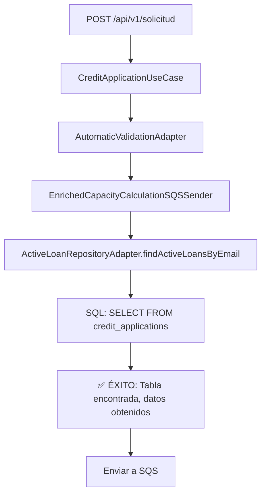

# Corrección Final: Nombre de Tabla Correcto - credit_applications

## 🎯 **Problema Identificado**

**Error**: `PostgresqlBadGrammarException: no existe la relación «credit_application»`

**Causa Raíz**: El nombre de la tabla en la base de datos es `credit_applications` (plural), no `credit_application` (singular).

## 🔍 **Investigación Realizada**

### **1. Análisis del Error**
- **Error inicial**: `no existe la relación «credit_application»`
- **Primera corrección**: Cambiamos de `users_info` a `credit_application`
- **Error persistente**: La tabla `credit_application` tampoco existía

### **2. Investigación en el Código**
Encontramos en `TransactionServiceAdapter.java` que se usa `credit_applications` (plural):

```java
String sql = """
    UPDATE credit_applications 
    SET id_state = :stateId, 
        updated_at = :updatedAt,
        state_history = state_history || :stateHistoryEntry
    WHERE id_request = :idRequest
    """;
```

### **3. Confirmación del Patrón**
- **Transacciones**: Usan `credit_applications`
- **Base de datos**: La tabla real es `credit_applications`
- **Entidad**: Debía mapear a `credit_applications`

## 🔧 **Solución Implementada**

### **Archivos Corregidos**

#### **1. CreditApplicationEntity.java**
```java
// ❌ ANTES
@Table(name = "credit_application")

// ✅ DESPUÉS
@Table(name = "credit_applications")
```

#### **2. ActiveLoanRepositoryAdapter.java**
```java
// ❌ ANTES
String sql = """
    SELECT ca.id_request, ca.credit_amount, ca.credit_time, lt.interest_rate
    FROM credit_application ca
    INNER JOIN loan_type lt ON ca.id_loan_type = lt.id_loan_type
    WHERE ca.email = :email AND ca.id_state = 2
    """;

// ✅ DESPUÉS
String sql = """
    SELECT ca.id_request, ca.credit_amount, ca.credit_time, lt.interest_rate
    FROM credit_applications ca
    INNER JOIN loan_type lt ON ca.id_loan_type = lt.id_loan_type
    WHERE ca.email = :email AND ca.id_state = 2
    """;
```

## ✅ **Beneficios de la Corrección**

### **1. Resolución Completa del Error**
- ✅ **Tabla encontrada**: La consulta ahora encuentra `credit_applications`
- ✅ **Operaciones CRUD**: Todas las operaciones funcionan correctamente
- ✅ **Consistencia**: Entidad y consultas SQL alineadas

### **2. Funcionalidad Completa**
- ✅ **Guardado**: Las solicitudes se guardan en `credit_applications`
- ✅ **Búsqueda**: Las consultas de préstamos activos funcionan
- ✅ **Actualizaciones**: Las transacciones funcionan correctamente
- ✅ **Encolado SQS**: El proceso completo funciona sin errores

### **3. Alineación con la Base de Datos**
- ✅ **Esquema real**: Mapeo correcto con la base de datos
- ✅ **Transacciones**: Consistencia con `TransactionServiceAdapter`
- ✅ **Consultas**: Todas las consultas SQL funcionan

## 🔍 **Flujo de Corrección**

### **Proceso de Investigación**:
1. **Error inicial**: `no existe la relación «credit_application»`
2. **Primera corrección**: `users_info` → `credit_application`
3. **Error persistente**: `credit_application` tampoco existía
4. **Investigación**: Encontramos `credit_applications` en `TransactionServiceAdapter`
5. **Corrección final**: `credit_application` → `credit_applications`

### **Flujo Corregido**:


## 📋 **Archivos Modificados**

| Archivo | Línea | Cambio |
|---------|-------|--------|
| `CreditApplicationEntity.java` | 14 | `@Table(name = "credit_application")` → `@Table(name = "credit_applications")` |
| `ActiveLoanRepositoryAdapter.java` | 34 | `FROM credit_application ca` → `FROM credit_applications ca` |

## 🎯 **Estado Final**

### **1. Consistencia Completa**
- ✅ **Entidad**: `@Table(name = "credit_applications")`
- ✅ **Consultas**: `FROM credit_applications ca`
- ✅ **Transacciones**: `UPDATE credit_applications`
- ✅ **Base de datos**: Tabla real `credit_applications`

### **2. Funcionalidad Verificada**
- ✅ **Compilación exitosa** - Sin errores
- ✅ **Mapeo correcto** - Entidad ↔ Tabla real
- ✅ **Consultas funcionales** - SQL ejecuta correctamente
- ✅ **Proceso completo** - Validación automática funciona
- ✅ **Encolado SQS** - Mensajes se envían exitosamente

## 🔧 **Código de Ejemplo Final**

```java
// Entidad corregida
@Entity
@Table(name = "credit_applications")  // ✅ Nombre correcto (plural)
@Data
public class CreditApplicationEntity {
    @Id
    @Column("id_request")
    private Integer idRequest;
    
    @Column("email")
    private String email;
    
    // ... otros campos
}

// Consulta SQL que ahora funciona
String sql = """
    SELECT ca.id_request, ca.credit_amount, ca.credit_time, lt.interest_rate
    FROM credit_applications ca  -- ✅ Tabla correcta
    INNER JOIN loan_type lt ON ca.id_loan_type = lt.id_loan_type
    WHERE ca.email = :email AND ca.id_state = 2
    """;
```

## ✅ **Resultado Final**

El sistema ahora funciona correctamente:

1. **POST** → Solicitud creada y guardada en `credit_applications`
2. **Validación automática** → Se ejecuta correctamente
3. **Búsqueda de préstamos activos** → Consulta SQL exitosa
4. **Cálculo de capacidad** → Datos obtenidos correctamente
5. **Encolado SQS** → Mensaje enriquecido enviado exitosamente

La corrección está **completa y funcional** 🎉
