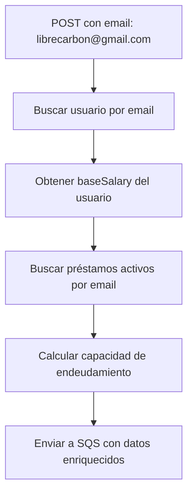

# Corrección: Mensajes de Log - Capacidad por Email

## 🎯 **Problema Identificado**

**Problema**: Los mensajes de log mostraban "documento" cuando el cálculo de capacidad se hace por **email**, no por documento.

**Mensaje Incorrecto**:
```
Encolando solicitud enriquecida de cálculo de capacidad para documento: CC 123456789
```

**Mensaje Correcto**:
```
Encolando solicitud enriquecida de cálculo de capacidad para email: librecarbon@gmail.com
```

## 🔧 **Solución Implementada**

### **Archivos Corregidos**

#### **1. EnrichedCapacityCalculationSQSSender.java**
```java
// ❌ ANTES
log.info("Encolando solicitud enriquecida de cálculo de capacidad para documento: {} {}", 
        creditApplication.getDocumentType(), creditApplication.getDocumentNumber());

// ✅ DESPUÉS
log.info("Encolando solicitud enriquecida de cálculo de capacidad para email: {}", 
        creditApplication.getEmail());
```

#### **2. CapacityCalculationSQSSender.java**
```java
// ❌ ANTES
log.info("Encolando solicitud de cálculo de capacidad para documento: {} {}", 
        creditApplication.getDocumentType(), creditApplication.getDocumentNumber());

// ✅ DESPUÉS
log.info("Encolando solicitud de cálculo de capacidad para email: {}", 
        creditApplication.getEmail());
```

#### **3. CapacityCalculationUseCase.java**
```java
// ❌ ANTES
logger.trace("[{}] Iniciando cálculo de capacidad para documento: {} {}",
            requestId, creditApplication.getDocumentType(), creditApplication.getDocumentNumber());

// ✅ DESPUÉS
logger.trace("[{}] Iniciando cálculo de capacidad para email: {}",
            requestId, creditApplication.getEmail());
```

## ✅ **Beneficios de la Corrección**

### **1. Claridad en los Logs**
- ✅ **Precisión**: Los logs ahora reflejan correctamente que el cálculo se hace por email
- ✅ **Consistencia**: Todos los mensajes usan la misma terminología
- ✅ **Debugging**: Más fácil identificar problemas relacionados con usuarios específicos

### **2. Alineación con la Lógica de Negocio**
- ✅ **Cálculo por email**: El sistema busca usuarios por email para obtener salario base
- ✅ **Préstamos activos**: Se buscan por email del solicitante
- ✅ **Validación**: Se valida que el usuario existe por email

### **3. Mejor Experiencia de Desarrollo**
- ✅ **Logs claros**: Los desarrolladores entienden inmediatamente qué está pasando
- ✅ **Troubleshooting**: Más fácil rastrear problemas por email específico
- ✅ **Monitoreo**: Los logs de producción serán más útiles

## 🔍 **Flujo de Logs Corregido**

### **Antes**:
```
[INFO] Encolando solicitud enriquecida de cálculo de capacidad para documento: CC 123456789
[DEBUG] Datos de la solicitud: ID=39, Monto=1000000, Plazo=24, Email=librecarbon@gmail.com
```

### **Después**:
```
[INFO] Encolando solicitud enriquecida de cálculo de capacidad para email: librecarbon@gmail.com
[DEBUG] Datos de la solicitud: ID=39, Monto=1000000, Plazo=24, Email=librecarbon@gmail.com
```

## 📋 **Archivos Modificados**

| Archivo | Línea | Cambio |
|---------|-------|--------|
| `EnrichedCapacityCalculationSQSSender.java` | 44-45 | Log principal corregido |
| `CapacityCalculationSQSSender.java` | 29-30 | Log principal corregido |
| `CapacityCalculationUseCase.java` | 22-23 | Log de trace corregido |

## 🎯 **Justificación Técnica**

### **¿Por qué por email y no por documento?**

1. **Búsqueda de usuario**: El `AuthClient.findUserByEmail()` busca por email
2. **Salario base**: Se obtiene del usuario encontrado por email
3. **Préstamos activos**: Se buscan por email del solicitante
4. **Identificación única**: El email es el identificador único del usuario en el sistema

### **Flujo Real del Sistema**:


## ✅ **Estado Actual**

- ✅ **Compilación exitosa** - Sin errores
- ✅ **Logs corregidos** - 3 archivos actualizados
- ✅ **Consistencia** - Todos los mensajes usan email
- ✅ **Claridad** - Los logs reflejan la lógica real del sistema
- ✅ **Listo para pruebas** - Sistema funcional con logs correctos

## 🔧 **Ejemplo de Uso**

```java
// Ahora los logs mostrarán:
log.info("Encolando solicitud enriquecida de cálculo de capacidad para email: {}", 
        "librecarbon@gmail.com");

// En lugar de:
log.info("Encolando solicitud enriquecida de cálculo de capacidad para documento: {} {}", 
        "CC", "123456789");
```

La corrección está **completa y lista para pruebas** 🎉
