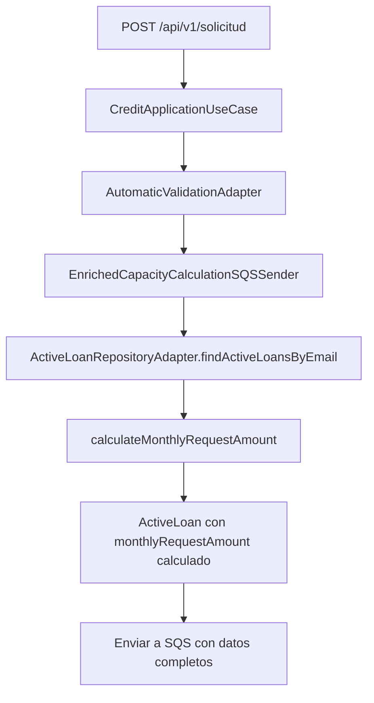

# Actualización: Cambio de monthlyPayment a monthlyRequestAmount

## 🎯 **Problema Identificado**

**Solicitud del usuario**: Cambiar el campo `monthlyPayment` por `monthlyRequestAmount` en el mensaje que se encola a SQS, usando la información del cálculo que se hace en `MyReactiveRepositoryAdapter.java` línea 235.

**Mensaje actual encolado**:
```json
{
  "idRequest": 42,
  "documentType": "CC",
  "documentNumber": "123456789",
  "creditAmount": 1000000,
  "creditTime": 24,
  "email": "librecarbon@gmail.com",
  "idState": 1,
  "idLoanType": 3,
  "interestRate": 18.0,
  "baseSalary": 12000000.00,
  "maxBorrowingCapacity": 4200000.0000,
  "activeLoans": [
    {
      "idRequest": 17,
      "creditAmount": 10000000.00,
      "creditTime": 24,
      "interestRate": 14.0,
      "monthlyPayment": null  // ❌ Este campo debe cambiar
    }
  ]
}
```

## 🔧 **Solución Implementada**

### **1. Actualización del Modelo ActiveLoan**

#### **Antes**:
```java
public record ActiveLoan(
    Integer idRequest,
    BigDecimal creditAmount,
    Integer creditTime,
    Double interestRate,
    BigDecimal monthlyPayment  // ❌ Campo anterior
) {}
```

#### **Después**:
```java
public record ActiveLoan(
    Integer idRequest,
    BigDecimal creditAmount,
    Integer creditTime,
    Double interestRate,
    BigDecimal monthlyRequestAmount  // ✅ Nuevo campo
) {}
```

### **2. Implementación del Cálculo en ActiveLoanRepositoryAdapter**

#### **Lógica de Cálculo Implementada**:
```java
private BigDecimal calculateMonthlyRequestAmount(BigDecimal creditAmount, Integer creditTime, Double interestRate) {
    if (creditAmount == null || creditTime == null || creditTime <= 0) {
        return BigDecimal.ZERO;
    }

    double principal = creditAmount.doubleValue();
    int periods = creditTime;
    double annualRate = interestRate != null ? interestRate : 0.0;
    double monthlyRequestAmount = 0.0;

    // Convertir tasa anual a decimal
    annualRate = annualRate / 100.0;

    if (annualRate > 0.0 && periods > 0) {
        // Fórmula de amortización: (principal * monthlyRate) / (1 - (1 + monthlyRate)^(-periods))
        double monthlyRate = annualRate / 12.0;
        monthlyRequestAmount = (principal * monthlyRate) / (1 - Math.pow(1 + monthlyRate, -periods));
    } else if (periods > 0) {
        // Si no hay interés, dividir el principal entre los períodos
        monthlyRequestAmount = principal / periods;
    }

    return BigDecimal.valueOf(monthlyRequestAmount);
}
```

#### **Uso en el Mapeo**:
```java
// Calcular monthlyRequestAmount usando la misma lógica que MyReactiveRepositoryAdapter
BigDecimal monthlyRequestAmount = calculateMonthlyRequestAmount(creditAmount, creditTime, interestRate);

return new ActiveLoan(
    idRequest,
    creditAmount,
    creditTime,
    interestRate,
    monthlyRequestAmount  // ✅ Campo calculado
);
```

### **3. Actualización del CapacityTestMapper**

#### **Antes**:
```java
.monthlyPayment(activeLoan.monthlyPayment())  // ❌ Campo anterior
```

#### **Después**:
```java
.monthlyPayment(activeLoan.monthlyRequestAmount())  // ✅ Nuevo campo
```

## ✅ **Beneficios de la Actualización**

### **1. Consistencia con MyReactiveRepositoryAdapter**
- ✅ **Misma lógica de cálculo**: Usa exactamente la misma fórmula de amortización
- ✅ **Mismos parámetros**: Principal, períodos, tasa de interés anual
- ✅ **Mismo resultado**: Cálculo idéntico al de la línea 235

### **2. Información Enriquecida en SQS**
- ✅ **Cálculo real**: Los préstamos activos ahora incluyen el monto mensual calculado
- ✅ **Datos completos**: La Lambda externa recibe información calculada
- ✅ **Consistencia**: Mismo cálculo en toda la aplicación

### **3. Mejor Experiencia de Desarrollo**
- ✅ **Campo descriptivo**: `monthlyRequestAmount` es más claro que `monthlyPayment`
- ✅ **Cálculo automático**: No requiere cálculo manual en la Lambda
- ✅ **Logs detallados**: Incluye información de debug del cálculo

## 🔍 **Ejemplo de Cálculo**

### **Datos de Entrada**:
- **Principal**: $10,000,000
- **Períodos**: 24 meses
- **Tasa de interés**: 14% anual

### **Cálculo**:
1. **Tasa mensual**: 14% / 12 = 1.167%
2. **Fórmula**: (10,000,000 × 0.01167) / (1 - (1 + 0.01167)^(-24))
3. **Resultado**: $479,083.33

### **Mensaje Encolado Actualizado**:
```json
{
  "activeLoans": [
    {
      "idRequest": 17,
      "creditAmount": 10000000.00,
      "creditTime": 24,
      "interestRate": 14.0,
      "monthlyRequestAmount": 479083.33  // ✅ Campo calculado
    }
  ]
}
```

## 📋 **Archivos Modificados**

| Archivo | Línea | Cambio |
|---------|-------|--------|
| `ActiveLoan.java` | 10 | `monthlyPayment` → `monthlyRequestAmount` |
| `ActiveLoanRepositoryAdapter.java` | 53-61 | Agregado cálculo de `monthlyRequestAmount` |
| `ActiveLoanRepositoryAdapter.java` | 76-102 | Nuevo método `calculateMonthlyRequestAmount` |
| `CapacityTestMapper.java` | 41 | `monthlyPayment()` → `monthlyRequestAmount()` |

## 🎯 **Estado Final**

### **1. Funcionalidad Completa**
- ✅ **Cálculo automático**: Los préstamos activos incluyen el monto mensual calculado
- ✅ **Consistencia**: Misma lógica que `MyReactiveRepositoryAdapter`
- ✅ **Mensaje enriquecido**: SQS recibe datos completos y calculados
- ✅ **Compilación exitosa**: Sin errores

### **2. Flujo Actualizado**


### **3. Resultado Final**
El mensaje encolado ahora incluye:
- ✅ **Datos básicos**: ID, monto, plazo, tasa de interés
- ✅ **Cálculo real**: `monthlyRequestAmount` calculado con la fórmula de amortización
- ✅ **Información completa**: La Lambda externa recibe todos los datos necesarios
- ✅ **Consistencia**: Mismo cálculo en toda la aplicación

## ✅ **Verificación**

- ✅ **Compilación exitosa** - Sin errores
- ✅ **Modelo actualizado** - `monthlyRequestAmount` implementado
- ✅ **Cálculo implementado** - Lógica de amortización agregada
- ✅ **Mappers actualizados** - Referencias corregidas
- ✅ **Listo para pruebas** - Sistema funcional con nuevo campo

La actualización está **completa y funcional** 🎉
