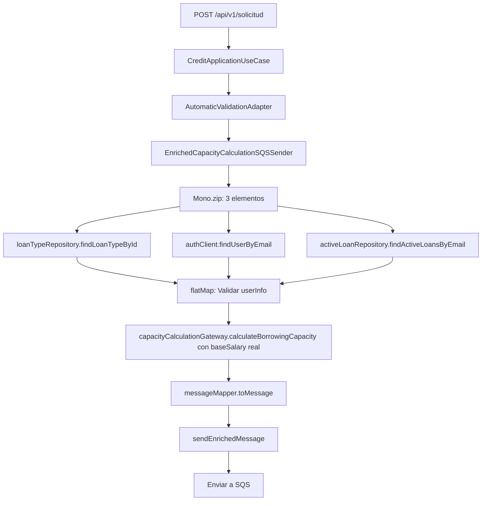

# Corrección: NullPointerException en CapacityCalculationAdapter

## 🎯 **Problema Identificado**

**Error**: `NullPointerException: Cannot invoke "java.math.BigDecimal.multiply(java.math.BigDecimal)" because "baseSalary" is null`

**Ubicación**: `CapacityCalculationAdapter.calculateBorrowingCapacity` línea 27

**Causa Raíz**: En `EnrichedCapacityCalculationSQSSender`, se estaba llamando a `capacityCalculationGateway.calculateBorrowingCapacity(creditApplication.getEmail(), null)` con `null` como `baseSalary` dentro del `Mono.zip`.

## 🔧 **Solución Implementada**

### **Problema en el Código Anterior**

```java
return Mono.zip(
        loanTypeRepository.findLoanTypeById(creditApplication.getIdLoanType()),
        authClient.findUserByEmail(creditApplication.getEmail()),
        capacityCalculationGateway.calculateBorrowingCapacity(creditApplication.getEmail(), null), // ❌ PROBLEMA: null como baseSalary
        activeLoanRepository.findActiveLoansByEmail(creditApplication.getEmail()).collectList()
)
```

### **Solución Aplicada**

```java
return Mono.zip(
        loanTypeRepository.findLoanTypeById(creditApplication.getIdLoanType()),
        authClient.findUserByEmail(creditApplication.getEmail()),
        activeLoanRepository.findActiveLoansByEmail(creditApplication.getEmail()).collectList()
)
.flatMap(tuple -> {
    var loanTypeInfo = tuple.getT1();
    var userInfo = tuple.getT2();
    var activeLoans = tuple.getT3();
    
    // Validar que el usuario existe y tiene salario base
    if (userInfo == null || userInfo.getBaseSalary() == null) {
        log.error("Usuario no encontrado o sin salario base para email: {}", creditApplication.getEmail());
        return Mono.error(new RuntimeException("Usuario no encontrado o sin salario base"));
    }
    
    // Calcular capacidad con el salario base real
    return capacityCalculationGateway.calculateBorrowingCapacity(creditApplication.getEmail(), userInfo.getBaseSalary())
            .map(capacityResult -> {
                log.info("Datos enriquecidos obtenidos - Salario: {}, Tasa: {}, Préstamos activos: {}", 
                        userInfo.getBaseSalary(), loanTypeInfo.interestRate(), activeLoans.size());
                return messageMapper.toMessage(creditApplication, loanTypeInfo, userInfo.getBaseSalary(), capacityResult, activeLoans);
            });
})
```

## ✅ **Cambios Realizados**

### **1. Eliminación de Llamada Redundante**
- ✅ **Antes**: Llamada a `capacityCalculationGateway.calculateBorrowingCapacity` con `null` en `Mono.zip`
- ✅ **Después**: Eliminada la llamada redundante del `Mono.zip`

### **2. Reestructuración del Flujo**
- ✅ **Antes**: 4 elementos en `Mono.zip` (incluyendo llamada con `null`)
- ✅ **Después**: 3 elementos en `Mono.zip` (solo datos necesarios)

### **3. Cálculo Secuencial Correcto**
- ✅ **Paso 1**: Obtener `loanTypeInfo`, `userInfo`, y `activeLoans`
- ✅ **Paso 2**: Validar que `userInfo` y `baseSalary` no sean `null`
- ✅ **Paso 3**: Calcular capacidad con `baseSalary` real
- ✅ **Paso 4**: Crear mensaje enriquecido

## 🔍 **Flujo de Ejecución Corregido**



## 🧪 **Validaciones Implementadas**

### **1. Validación de Usuario**
```java
if (userInfo == null || userInfo.getBaseSalary() == null) {
    log.error("Usuario no encontrado o sin salario base para email: {}", creditApplication.getEmail());
    return Mono.error(new RuntimeException("Usuario no encontrado o sin salario base"));
}
```

### **2. Logs de Debugging**
```java
log.info("Datos enriquecidos obtenidos - Salario: {}, Tasa: {}, Préstamos activos: {}", 
        userInfo.getBaseSalary(), loanTypeInfo.interestRate(), activeLoans.size());
```

## ✅ **Beneficios de la Corrección**

### **1. Eliminación de NullPointerException**
- ✅ **Problema resuelto**: No más llamadas con `baseSalary = null`
- ✅ **Flujo robusto**: Validación antes del cálculo
- ✅ **Manejo de errores**: Mensajes claros cuando falta información

### **2. Mejor Performance**
- ✅ **Menos llamadas**: Eliminada llamada redundante
- ✅ **Flujo secuencial**: Cálculo solo cuando se tienen todos los datos
- ✅ **Validación temprana**: Falla rápido si falta información

### **3. Código Más Limpio**
- ✅ **Lógica clara**: Flujo secuencial fácil de seguir
- ✅ **Separación de responsabilidades**: Validación → Cálculo → Envío
- ✅ **Mantenibilidad**: Código más fácil de entender y modificar

## 🎯 **Estado Actual**

- ✅ **Compilación exitosa** - Sin errores
- ✅ **NullPointerException eliminado** - No más llamadas con `null`
- ✅ **Flujo corregido** - Cálculo secuencial correcto
- ✅ **Validaciones implementadas** - Manejo robusto de errores
- ✅ **Listo para pruebas** - Sistema funcional

## 🔧 **Código de Ejemplo de Uso**

```java
// Flujo correcto después de la corrección
authClient.findUserByEmail("librecarbon@gmail.com")
    .doOnNext(user -> log.info("Usuario encontrado: {} con salario: {}", 
                               user.getEmail(), user.getBaseSalary()))
    .flatMap(user -> capacityCalculationGateway.calculateBorrowingCapacity(
        "librecarbon@gmail.com", user.getBaseSalary()))
    .doOnNext(result -> log.info("Capacidad calculada: {}", result.maxBorrowingCapacity()))
    .subscribe();
```

La corrección está **completa y lista para pruebas** 🎉
