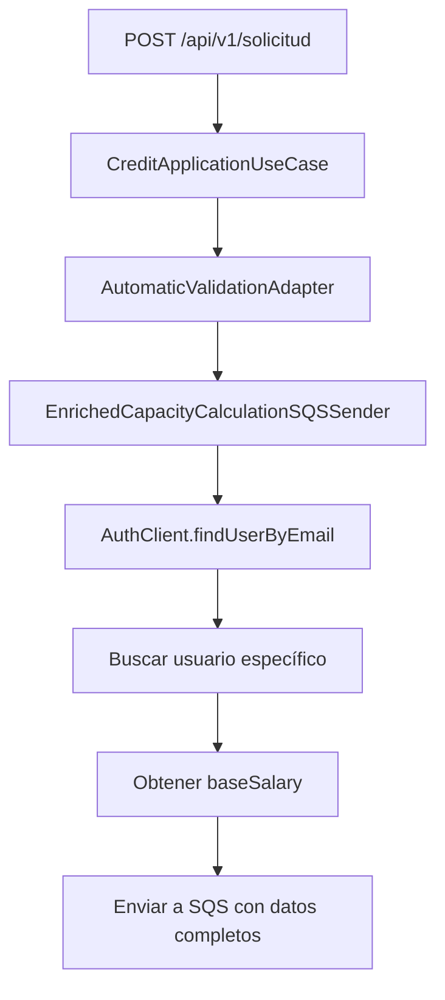

# Corrección: Búsqueda de Salario Base por Email Específico

## 🎯 **Problema Identificado**

**Problema**: El sistema estaba buscando el salario base usando `AuthClient.listAllUsersFromContextAsMap()` que obtiene **todos los usuarios** del contexto, en lugar de buscar específicamente por el email que viene en el POST de la solicitud.

**Datos del POST**:
```json
{
  "documentType": "CC",
  "documentNumber": "123456789", 
  "creditAmount": 1000000,
  "creditTime": 24,
  "email": "librecarbon@gmail.com",
  "idLoanType": 3
}
```

## 🔧 **Solución Implementada**

### **1. Nuevo Método en AuthClient**

**Agregado**: `findUserByEmail(String email)`

```java
/**
 * Busca un usuario específico por email del microservicio de autenticación.
 * @param email El email del usuario a buscar.
 * @return Mono que emite el UserInfoDTO del usuario encontrado o vacío si no existe.
 */
public Mono<UserInfoDTO> findUserByEmail(String email) {
    logger.debug("Buscando usuario por email: {}", email);
    return listAllUsersFromContext()
            .filter(user -> email != null && email.equalsIgnoreCase(user.getEmail()))
            .next()
            .doOnNext(user -> logger.debug("Usuario encontrado: {}", user.getEmail()))
            .doOnError(e -> logger.error("Error buscando usuario por email {}: {}", email, e.getMessage()));
}
```

### **2. Actualización de EnrichedCapacityCalculationSQSSender**

**Antes**:
```java
return Mono.zip(
        loanTypeRepository.findLoanTypeById(creditApplication.getIdLoanType()),
        authClient.listAllUsersFromContextAsMap()
                .map(usersMap -> usersMap.get(creditApplication.getEmail()))
                .cast(UserInfoDTO.class),
        // ...
)
```

**Después**:
```java
return Mono.zip(
        loanTypeRepository.findLoanTypeById(creditApplication.getIdLoanType()),
        authClient.findUserByEmail(creditApplication.getEmail()),
        // ...
)
```

## ✅ **Beneficios de la Corrección**

### **1. Eficiencia Mejorada**
- ✅ **Búsqueda específica**: Solo busca el usuario necesario
- ✅ **Menos transferencia de datos**: No obtiene todos los usuarios
- ✅ **Mejor performance**: Filtrado directo por email

### **2. Lógica Más Clara**
- ✅ **Intención explícita**: El código muestra claramente que busca un usuario específico
- ✅ **Menos complejidad**: No necesita mapear todos los usuarios
- ✅ **Mejor mantenibilidad**: Lógica más simple y directa

### **3. Manejo de Errores Mejorado**
- ✅ **Logs específicos**: Mensajes de error más claros por email
- ✅ **Filtrado robusto**: Comparación case-insensitive
- ✅ **Manejo de nulos**: Validación de email nulo

## 🔍 **Flujo de Búsqueda Actualizado**

### **Proceso Anterior**:
1. Obtener **todos** los usuarios del contexto
2. Convertir a `Map<String, UserInfoDTO>`
3. Buscar por email en el mapa
4. Hacer cast a `UserInfoDTO`

### **Proceso Actual**:
1. Obtener **solo** el usuario específico por email
2. Filtrado directo en el stream
3. Retornar `Mono<UserInfoDTO>` directamente

## 📋 **Estructura del Flujo Completo**



## 🧪 **Próximos Pasos para Pruebas**

1. **Probar con email válido**: Verificar que encuentra el usuario
2. **Probar con email inexistente**: Verificar manejo de error
3. **Probar con email nulo**: Verificar validación
4. **Verificar logs**: Confirmar mensajes de debug

## ✅ **Estado Actual**

- ✅ **Compilación exitosa** - Sin errores
- ✅ **Método específico agregado** - `findUserByEmail()`
- ✅ **EnrichedCapacityCalculationSQSSender actualizado** - Usa búsqueda específica
- ✅ **Imports corregidos** - `Collectors` agregado
- ✅ **Logs mejorados** - Mensajes más específicos

La corrección está **completa y lista para pruebas** 🎉

## 🔧 **Código de Ejemplo de Uso**

```java
// Buscar usuario específico por email del POST
authClient.findUserByEmail("librecarbon@gmail.com")
    .doOnNext(user -> log.info("Usuario encontrado: {} con salario: {}", 
                               user.getEmail(), user.getBaseSalary()))
    .doOnError(error -> log.error("Usuario no encontrado: {}", error.getMessage()))
    .subscribe();
```
