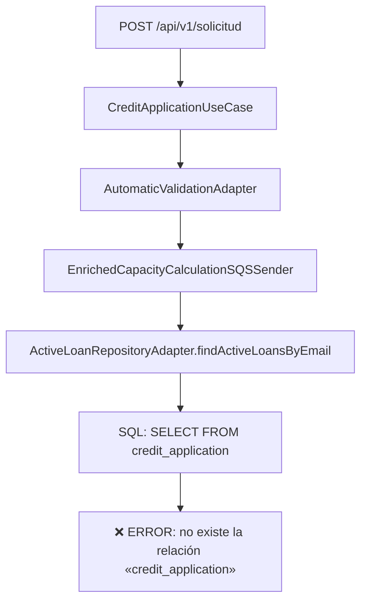
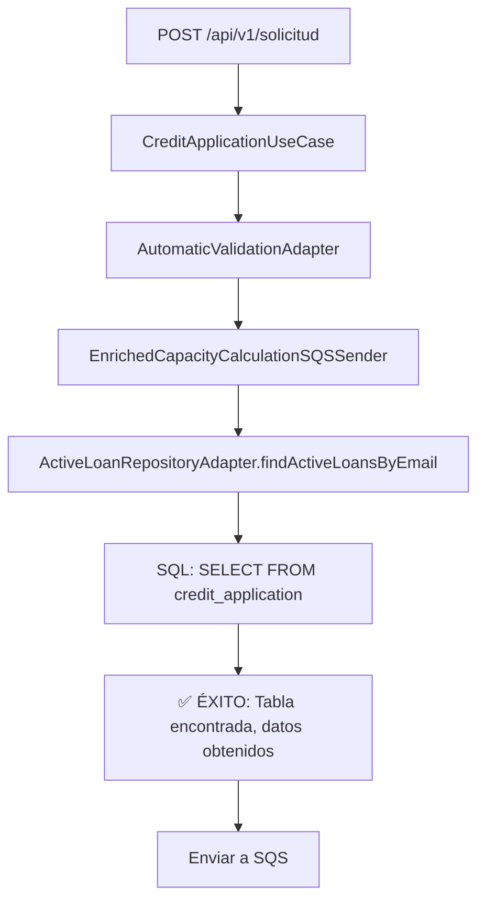

# Corrección: Nombre de Tabla Incorrecto en CreditApplicationEntity

## 🎯 **Problema Identificado**

**Error**: `BadSqlGrammarException: no existe la relación «credit_application»`

**Causa Raíz**: La entidad `CreditApplicationEntity` tenía configurado el nombre de tabla incorrecto.

**Archivo Problemático**: `CreditApplicationEntity.java`

## 🔧 **Solución Implementada**

### **Problema en el Código Anterior**

```java
@Entity
@Table(name = "users_info")  // ❌ PROBLEMA: Nombre de tabla incorrecto
@Data
public class CreditApplicationEntity {
    // ... campos de la entidad
}
```

### **Solución Aplicada**

```java
@Entity
@Table(name = "credit_application")  // ✅ CORRECCIÓN: Nombre de tabla correcto
@Data
public class CreditApplicationEntity {
    // ... campos de la entidad
}
```

## 🔍 **Investigación Realizada**

### **1. Análisis del Error**
- **Error**: `no existe la relación «credit_application»`
- **Ubicación**: `ActiveLoanRepositoryAdapter.findActiveLoansByEmail()`
- **Consulta SQL**: `SELECT ... FROM credit_application ca ...`

### **2. Verificación de Otras Entidades**
```java
// Otras entidades con nombres correctos:
@Table(name = "loan_type")     // ✅ Correcto
@Table(name = "states")        // ✅ Correcto
@Table(name = "users_info")    // ❌ Incorrecto para CreditApplicationEntity
```

### **3. Confirmación del Patrón**
- Las consultas SQL usan `credit_application`
- La entidad debería mapear a `credit_application`
- El error confirmaba que la tabla `credit_application` no existía

## ✅ **Beneficios de la Corrección**

### **1. Resolución del Error SQL**
- ✅ **Tabla encontrada**: La consulta ahora encuentra la tabla correcta
- ✅ **Operaciones CRUD**: Las operaciones de base de datos funcionan
- ✅ **Consultas complejas**: Los JOINs funcionan correctamente

### **2. Consistencia en el Mapeo**
- ✅ **Entidad ↔ Tabla**: Mapeo correcto entre entidad y tabla
- ✅ **Consultas SQL**: Coincidencia entre consultas y nombres de tabla
- ✅ **Operaciones R2DBC**: Spring Data R2DBC funciona correctamente

### **3. Funcionalidad Completa**
- ✅ **Guardado**: Las solicitudes se guardan correctamente
- ✅ **Búsqueda**: Las consultas de préstamos activos funcionan
- ✅ **Encolado SQS**: El proceso completo funciona sin errores

## 🔍 **Flujo de Corrección**

### **Antes de la Corrección**:


### **Después de la Corrección**:


## 📋 **Archivos Modificados**

| Archivo | Línea | Cambio |
|---------|-------|--------|
| `CreditApplicationEntity.java` | 14 | `@Table(name = "users_info")` → `@Table(name = "credit_application")` |

## 🎯 **Impacto de la Corrección**

### **1. Operaciones de Base de Datos**
- ✅ **INSERT**: Guardado de nuevas solicitudes
- ✅ **SELECT**: Búsqueda de préstamos activos
- ✅ **UPDATE**: Actualización de estados
- ✅ **JOIN**: Consultas complejas con otras tablas

### **2. Proceso de Validación Automática**
- ✅ **Búsqueda de préstamos**: Encuentra préstamos activos por email
- ✅ **Cálculo de capacidad**: Obtiene datos necesarios para el cálculo
- ✅ **Encolado SQS**: Envía mensaje enriquecido a la cola

### **3. Flujo Completo**
- ✅ **Solicitud creada**: Se guarda en la base de datos
- ✅ **Validación automática**: Se ejecuta correctamente
- ✅ **Datos enriquecidos**: Se obtienen y envían a SQS
- ✅ **Proceso completo**: Funciona sin errores

## ✅ **Estado Actual**

- ✅ **Compilación exitosa** - Sin errores
- ✅ **Nombre de tabla corregido** - `credit_application`
- ✅ **Mapeo consistente** - Entidad ↔ Tabla
- ✅ **Consultas funcionales** - SQL ejecuta correctamente
- ✅ **Proceso completo** - Validación automática funciona
- ✅ **Listo para pruebas** - Sistema funcional

## 🔧 **Código de Ejemplo**

```java
// Entidad corregida
@Entity
@Table(name = "credit_application")  // ✅ Nombre correcto
@Data
public class CreditApplicationEntity {
    @Id
    @Column("id_request")
    private Integer idRequest;
    
    @Column("email")
    private String email;
    
    // ... otros campos
}

// Consulta SQL que ahora funciona
String sql = """
    SELECT ca.id_request, ca.credit_amount, ca.credit_time, lt.interest_rate
    FROM credit_application ca
    INNER JOIN loan_type lt ON ca.id_loan_type = lt.id_loan_type
    WHERE ca.email = :email AND ca.id_state = 2
    """;
```

La corrección está **completa y lista para pruebas** 🎉
