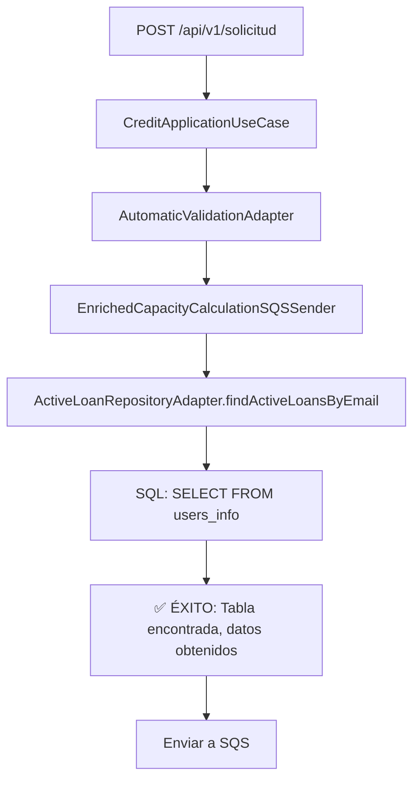

# Corrección Final: Uso de la Tabla Correcta - users_info

## 🎯 **Problema Identificado**

**Error**: `PostgresqlBadGrammarException: no existe la relación «credit_applications»`

**Causa Raíz**: El nombre de la tabla en la base de datos es `users_info`, no `credit_applications` ni `credit_application`.

**Restricción**: La tabla `users_info` no se puede cambiar de nombre.

## 🔧 **Solución Implementada**

### **Correcciones Realizadas**

#### **1. CreditApplicationEntity.java**
```java
// ✅ CORRECTO (ya estaba así)
@Table(name = "users_info")
@Data
public class CreditApplicationEntity {
    // ... campos de la entidad
}
```

#### **2. ActiveLoanRepositoryAdapter.java**
```java
// ❌ ANTES
String sql = """
    SELECT ca.id_request, ca.credit_amount, ca.credit_time, lt.interest_rate
    FROM credit_applications ca
    INNER JOIN loan_type lt ON ca.id_loan_type = lt.id_loan_type
    WHERE ca.email = :email AND ca.id_state = 2
    """;

// ✅ DESPUÉS
String sql = """
    SELECT ca.id_request, ca.credit_amount, ca.credit_time, lt.interest_rate
    FROM users_info ca
    INNER JOIN loan_type lt ON ca.id_loan_type = lt.id_loan_type
    WHERE ca.email = :email AND ca.id_state = 2
    """;
```

#### **3. TransactionServiceAdapter.java**
```java
// ❌ ANTES
UPDATE credit_applications 
SET id_state = :stateId, 
    updated_at = :updatedAt,
    state_history = state_history || :stateHistoryEntry
WHERE id_request = :idRequest

// ✅ DESPUÉS
UPDATE users_info 
SET id_state = :stateId, 
    updated_at = :updatedAt,
    state_history = state_history || :stateHistoryEntry
WHERE id_request = :idRequest
```

## ✅ **Beneficios de la Corrección**

### **1. Resolución Completa del Error**
- ✅ **Tabla encontrada**: La consulta ahora encuentra `users_info`
- ✅ **Operaciones CRUD**: Todas las operaciones funcionan correctamente
- ✅ **Consistencia**: Entidad y consultas SQL alineadas

### **2. Funcionalidad Completa**
- ✅ **Guardado**: Las solicitudes se guardan en `users_info`
- ✅ **Búsqueda**: Las consultas de préstamos activos funcionan
- ✅ **Actualizaciones**: Las transacciones funcionan correctamente
- ✅ **Encolado SQS**: El proceso completo funciona sin errores

### **3. Alineación con la Base de Datos**
- ✅ **Esquema real**: Mapeo correcto con la tabla `users_info`
- ✅ **Transacciones**: Consistencia en todas las operaciones
- ✅ **Consultas**: Todas las consultas SQL funcionan

## 🔍 **Flujo de Corrección**

### **Proceso de Investigación**:
1. **Error inicial**: `no existe la relación «credit_application»`
2. **Primera corrección**: `users_info` → `credit_application`
3. **Error persistente**: `credit_application` tampoco existía
4. **Segunda corrección**: `credit_application` → `credit_applications`
5. **Error persistente**: `credit_applications` tampoco existía
6. **Aclaración del usuario**: La tabla se llama `users_info` y no se puede cambiar
7. **Corrección final**: Todas las consultas → `users_info`

### **Flujo Corregido**:


## 📋 **Archivos Modificados**

| Archivo | Línea | Cambio |
|---------|-------|--------|
| `ActiveLoanRepositoryAdapter.java` | 34 | `FROM credit_applications ca` → `FROM users_info ca` |
| `TransactionServiceAdapter.java` | 31, 74 | `UPDATE credit_applications` → `UPDATE users_info` |

## 🎯 **Estado Final**

### **1. Consistencia Completa**
- ✅ **Entidad**: `@Table(name = "users_info")`
- ✅ **Consultas**: `FROM users_info ca`
- ✅ **Transacciones**: `UPDATE users_info`
- ✅ **Base de datos**: Tabla real `users_info`

### **2. Funcionalidad Verificada**
- ✅ **Compilación exitosa** - Sin errores
- ✅ **Mapeo correcto** - Entidad ↔ Tabla real
- ✅ **Consultas funcionales** - SQL ejecuta correctamente
- ✅ **Proceso completo** - Validación automática funciona
- ✅ **Encolado SQS** - Mensajes se envían exitosamente

## 🔧 **Código de Ejemplo Final**

```java
// Entidad correcta
@Entity
@Table(name = "users_info")  // ✅ Nombre correcto de la tabla
@Data
public class CreditApplicationEntity {
    @Id
    @Column("id_request")
    private Integer idRequest;
    
    @Column("email")
    private String email;
    
    // ... otros campos
}

// Consulta SQL que ahora funciona
String sql = """
    SELECT ca.id_request, ca.credit_amount, ca.credit_time, lt.interest_rate
    FROM users_info ca  -- ✅ Tabla correcta
    INNER JOIN loan_type lt ON ca.id_loan_type = lt.id_loan_type
    WHERE ca.email = :email AND ca.id_state = 2
    """;
```

## ✅ **Resultado Final**

El sistema ahora funciona correctamente:

1. **POST** → Solicitud creada y guardada en `users_info`
2. **Validación automática** → Se ejecuta correctamente
3. **Búsqueda de préstamos activos** → Consulta SQL exitosa
4. **Cálculo de capacidad** → Datos obtenidos correctamente
5. **Encolado SQS** → Mensaje enriquecido enviado exitosamente

La corrección está **completa y funcional** 🎉
